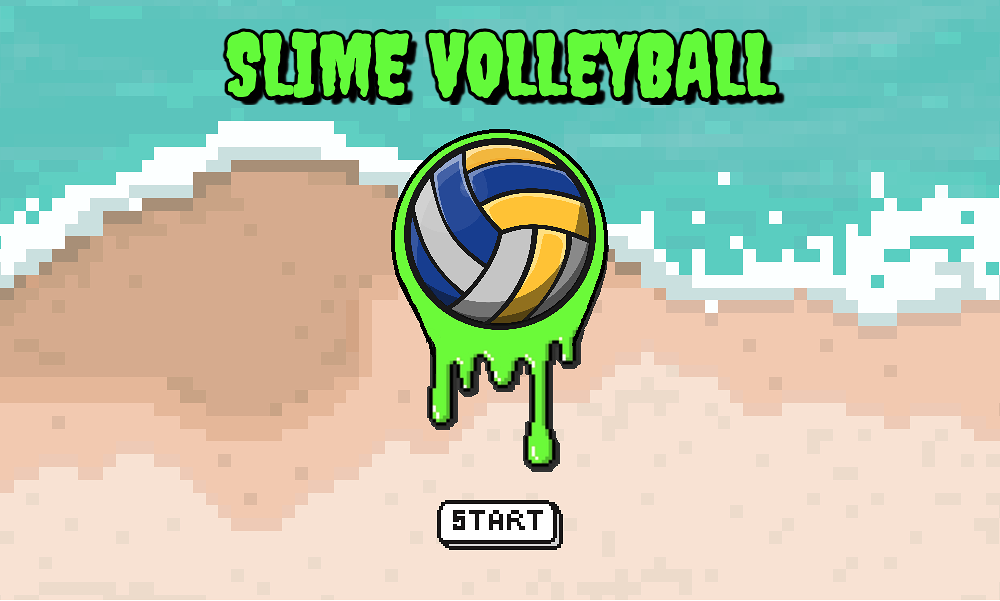
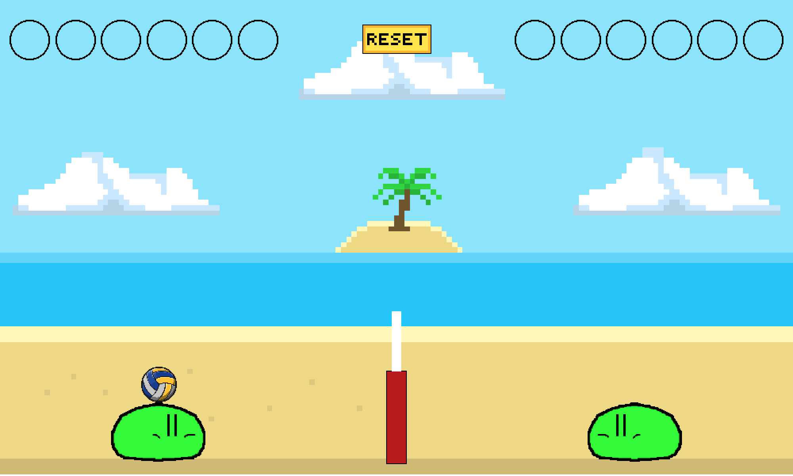

# Slime Volleyball

This is a recreation of the classic Slime Volleyball game. It was created for my first [Mintbean Hackathon](https://mintbean.io/meets/d51762d5-b874-4cc1-a420-ff316600192f) in August 2021. If you'd like to learn more about the awesome community at Mintbean be sure to check them out [here](https://info.mintbean.io/).

Deployed Link: https://slime-haikyu.netlify.app/

## How To Play

It's a 2 player volleyball game. Player 1 is on the left and Player 2 is on the right. If the ball touches the ground on your side, the opponent scores a point.

First to score 6 points wins!

Player 1 controls: W, S, A, D

Player 2 controls: Up, Down, Left, Right

Click the 'Reset' button to restart at any time.

### ScreenShots

## Technologies Used

- Phaser 3
- Javascript
- React
- CSS
- HTML

## Available Scripts

In the project directory, you can run:

### `npm run start`

Runs the app in the development mode.\
Open [http://localhost:3000](http://localhost:3000) to view it in the browser.

The page will reload if you make edits.\
You will also see any lint errors in the console.

### `npm run build`

Builds the app for production to the `build` folder.\
It correctly bundles React in production mode and optimizes the build for the best performance.

The build is minified and the filenames include the hashes.\
Your app is ready to be deployed!

See the section about [deployment](https://facebook.github.io/create-react-app/docs/deployment) for more information.
